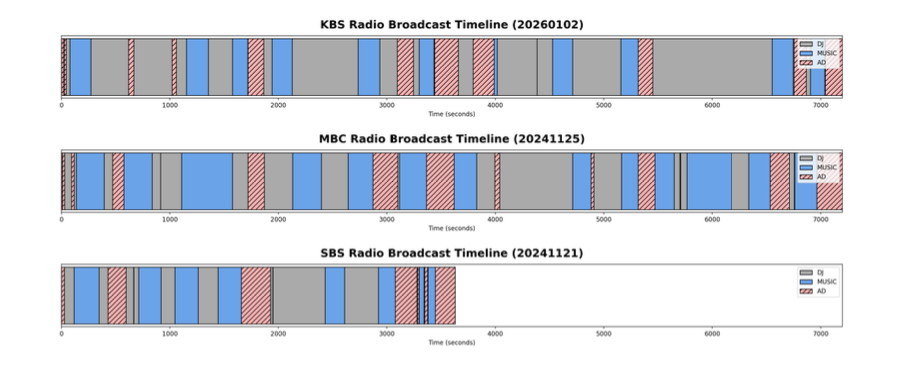

# Hybrid Role-Aware Structural Modeling and Semantic Extraction for Long-Form Radio Broadcasts

## Output Example

**방송사별 타임라인**



> **Interspeech 2026 제출 논문** | Chungnam National University, Data Network Research Lab
[](./paper/interspeech2026.pdf)
KBS·MBC·SBS 라디오 방송 **30일(50시간, 21,555 세그먼트)** 대상으로 DJ / 음악 / 광고 블록을 자동 구조화하고 LLM 기반 메타데이터를 추출하는 하이브리드 파이프라인입니다.

---

## Results

| Block | Precision | Recall | F1 |
|-------|-----------|--------|----|
| DJ | 0.91 | 0.92 | **0.91** |
| Music | 0.91 | 0.89 | **0.90** |
| Advertisement | 0.91 | 0.88 | **0.88** |

- 광고 블록 F1: baseline 0.62 → proposed **0.88** (+0.26)
- 개별 광고 단위 F1: **0.93**
- DJ 요약 품질 (human eval, 5점 만점): **4.42 / 5**
- 광고 entity 추출 F1 (company or product): **0.78**

---

## Pipeline Overview

```
Radio MP3 (KBS / MBC / SBS)
        │
        ▼
[1. VAD + ASR + Speaker Diarization]  ← WhisperX
        │
        ▼
[2. DJ Block Detection]               ← Speaker role anchoring
        │
        ├──▶ [3. Music Block Detection]     ← Acoustic features (RMS, dB)
        │
        └──▶ [4. AD Block Detection]        ← Cross-day audio fingerprinting (Panako)
                        │
                        ▼
             [5. Semantic Extraction]       ← GPT-4o (DJ summary / Music metadata / AD entities)
```

---

## Key Methods

### DJ Block Detection
화자 분리(pyannote) 결과를 기반으로 프로그램 호스트를 글로벌 구조적 앵커로 식별.
- 누적 발화 시간 $T_i$ 및 오프닝 구간 발화 비율 $O_i$로 DJ 판별
- DJ 세그먼트를 먼저 확정하여 이후 단계의 분류 정밀도 향상

### Music vs. Advertisement 분리
- 보컬/음악 에너지 차이, 에너지 드롭 구간(3초 단위 이동평균)으로 음악 블록 필터링
- 최소 유효 길이(≥100s) 조건 추가 적용

### Cross-Day Audio Fingerprinting (AD Detection)
- Panako로 전날 방송 대비 반복 등장 구간 매칭
- 클립 길이 20s / 스텝 3s / 매칭 스코어 임계값 100 / 병합 갭 30s
- baseline precision 0.50 → **0.91** 달성

### LLM-based Semantic Extraction (GPT-4o)
- DJ 블록: 대화 주제 및 요약 생성
- 음악 블록: 곡명·아티스트 추출 (F1 0.70)
- 광고 블록: 브랜드·제품명 추출 (F1 0.78)

---

## Dataset

| 방송사 | 장르 | 수집일 | 총 시간 | 세그먼트 수 |
|--------|------|--------|---------|------------|
| KBS | K-Pop | 10일 | 20h | 8,256 |
| MBC | Pop | 10일 | 20h | 8,645 |
| SBS | 영화음악 | 10일 | 10h | 4,654 |
| **합계** | | **30일** | **50h** | **21,555** |

> 저작권 제한으로 원본 오디오는 미포함. Ground truth 샘플 및 평가 결과는 `data_sample/AD/`에 포함.

---

## Repository Structure

```
├── ad/
│   ├── seg-lookup.py              # Panako 쿼리 (cross-day 매칭)
│   ├── cluster-max.py             # 매칭 결과 클러스터링 → AD 블록
│   ├── whisper_ad_faster.py       # 감지된 광고 클립 전사
│   ├── evaluate_individual_ads.py # 감지 + entity 추출 평가
│   ├── evaluate_ad_block_baseline.py
│   └── make_radio_timeline.py     # DJ/Music/AD 타임라인 시각화
├── data_sample/
│   └── AD/
│       ├── input/  {KBS,MBC,SBS}/{date}-truth_block.csv
│       └── output/results/
└── requirements.txt
```

---

## Usage

```bash
# Step 1: Panako 쿼리 (전날 인덱스 대비 당일 클립 매칭)
python ad/seg-lookup.py /data/baechulsu/20241125/clips/ 20241124

# Step 2: 매칭 결과 → AD 블록 클러스터링
python ad/cluster-max.py 20241125-20241124-compare.csv --gap_threshold 30

# Step 3: 감지된 광고 클립 전사 (선택)
python ad/whisper_ad_faster.py \
    --input 20241125-20241124-compare-ad-result.csv \
    --output 20241125-20241124-compare-ad-whisper.csv

# Step 4: 평가 (감지 + entity 추출)
python ad/evaluate_individual_ads.py --broadcaster baechulsu --date 20241125
python ad/evaluate_individual_ads.py --broadcaster all

# Step 5: 타임라인 시각화
python ad/make_radio_timeline.py
```

---

## Requirements

```bash
pip install -r requirements.txt
```

External:
- [Panako](https://github.com/JorenSix/Panako) — 오디오 핑거프린팅 (별도 설치 및 인덱싱 필요)
- [faster-whisper](https://github.com/SYSTRAN/faster-whisper)
- OpenAI API key (entity 추출용)

```bash
export RADIO_DATA_ROOT=/path/to/your/broadcast/data
export OPENAI_API_KEY=your_openai_key
```

---

## License

MIT License
